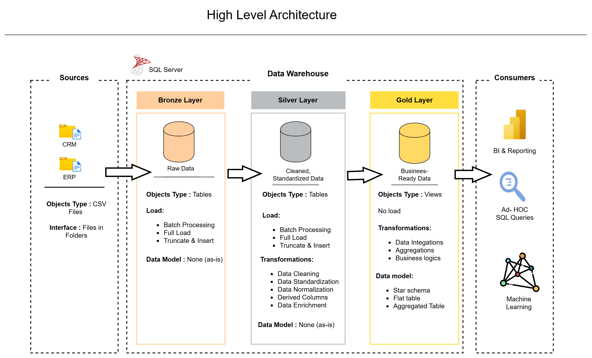

# **Building the Data Warehouse (Data Engineering)**

### Objective
Develop a modern data warehouse using SQL to consolidate sales data, enabling analytical reporting and informed decision making.

#### Specifications
- **Data Source**: Import data from two source systems (CRM and ERP) Provided as CSV files.
- **Data Quality**: Clean and resolve data quality issues prior to anlysis.
- **Integration**: Combine both source systems into one single , user-friendly  data model designed for analytical queries.
- **Scope**: Focus on the latest dataset only, historization of data is not required.
- **Documentation**: Provide clear documentation for the data model to support the business stakeholders and analytical teams.

### BI: Analytics and Reporting (Data Analysis)
#### Objective
Develop SQL based analytics to deliver insights into.
- **Customer Behavior**
- **Product Performance**
- **Sales Trends**
These insights empower stakeholders with key business metrics, enabling strategic decision-making.

## License
This project is licensed under [MIT License](LICENSE). You are free to use modify and share this project with proper attribution.

## About Me
Hi there! I'm **Dharmveer**. I am starting my journey in analytics with this project.

